# Bookworms
In this project, we designed a database in MySQL and developt a web application in PHP Laravel, ‘Bookworms’ like the website ‘Goodreads’(​https://www.goodreads.com/​). Similar to Goodreads, in Bookworms, users are able to keep track of their books and authors, add and discuss books with other users, see quotes from authors, know about publishers of books and the addresses of their stores and publishing houses, become friends with other users and also can see other users’ books, authors, discussion, posts, comments. In Bookworms, there are also admins who are capable of actions which normal users are not able to do like deleting or updating discussions, posts, informations of book stores and publishing houses of publishers, quotes from authors.  

### Scenario For Each User Type  
There are two types of user in Bookworms, one is ordinary user and the other one is admin. 

#### Ordinary users are able to: 
- log into Bookworms and log out from it. 
- list all books and authors they have read and are reading currently in their profile. 
- list all their friends and remove them in their profile. 
- remove their friends and books they have read in their profile.(it’s not necessary to remove authors in their profile because authors are automatically added and deleted based on books they read) 
- send friend requests to users and see requests which has been sent to them, and they can accept or decline these request except for sending these request to admins but they can get friend requests from admins. 
- list all statistics information about their friends, book and authors like how many books and authors they have read, how many friends they have, what’s the biggest and smallest book they have read, when did they started to read their first book and last book. 
- send and receive messages from their friends. 
- see quotes from authors and also add quotes of authors which they want. 
- start discussions, create posts in discussions and add comments to these posts and delete their own discussions and posts and comments. When users delete a post all comments under the posts are automatically deleted and when they delete a discussions they started all the posts and all the comments under those posts are deleted automatically. 
- see all publishers of books and stores of these publishers. 
- add books and authors to the database. 
- see other users’ last 10 actions in the dashboard panel.  

#### Admins are able to do everything that normal users do and also are able to: 
- send friend requests both to normal users and to admins. 
- delete any discussions that are started by users, any posts under all discussions and any comments under all posts. 
- see printing houses of publishers, delete and update them.(this are just shown to admin just in case the website can be connection between courier companies and publishers if they both have an agreement) 
- add, delete and update information of publishers and information of stores of these publishers. 

## Usage of Bookworms

### Profile Page
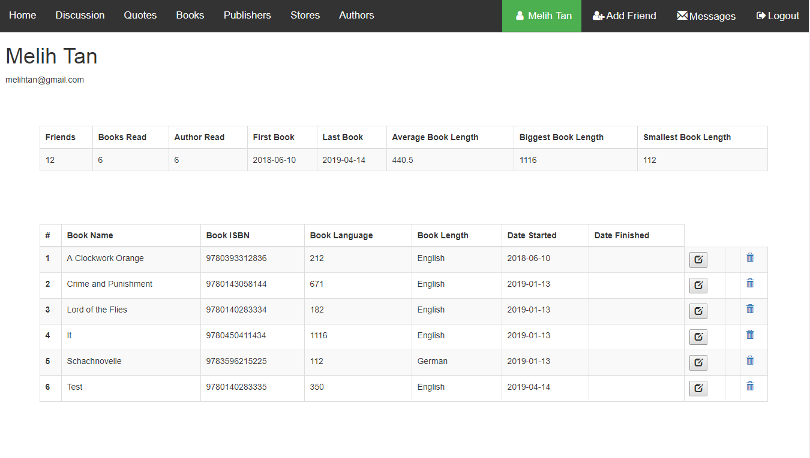

  <b>Figure 1</b> 
 

                   
As you can see in the *Figure 1*, users can see their information, the books they have read, when they started to read, when they finished reading(if they finished).And they can also remove any book they have read or edit the date of starting of the date of finishing books.  

Users can list the statistics like the number of their friends, the number of books they have read, the number of author they have read, the date of starting to read their first book, the date of starting to read their last book, average length of books they have read, the biggest book length, and the smallest book length. 

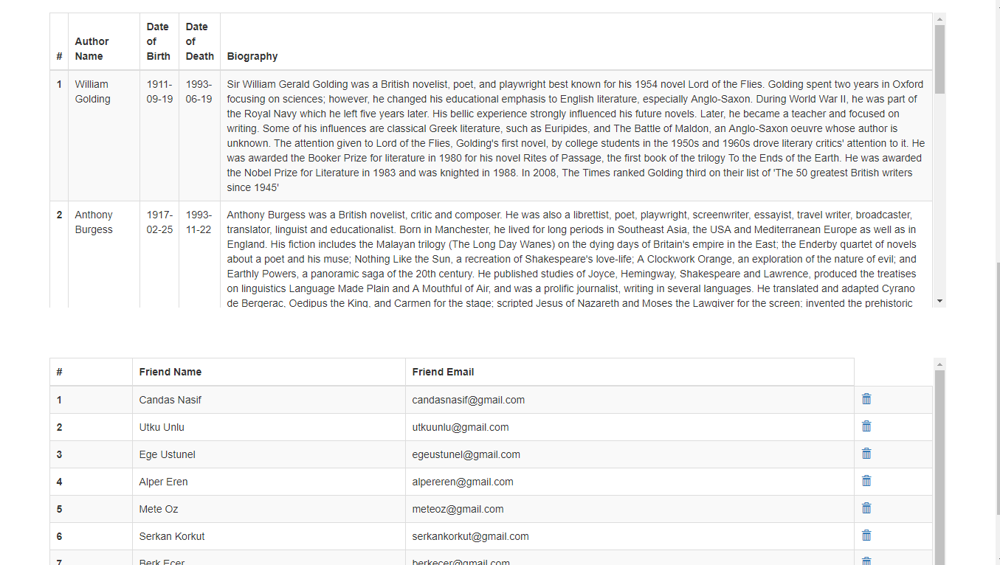

  <b>Figure 2</b> 
 

 
Users can lists the authors they have read, they are not able to delete the authors they have read because these authors are automatically listed when they add books to their libraries and automatically deleted when they remove books from their libraries in their profile page.  

They also can list their friends and their information, they also can remove friend in this profile page. When they remove friends of theirs, the user automatically removed from the friend lists of corresponding users.

### Messaging

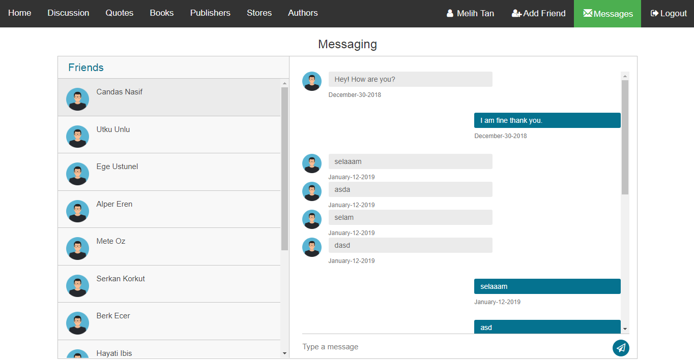

  <b>Figure 3</b> 

 
 As you can see in the *Figure 3*, users can send messages to their friend and receive messages from them in the messaging page. These messages ordered by date, and the date of message are listed below these messages.
 
### Add Friend Page

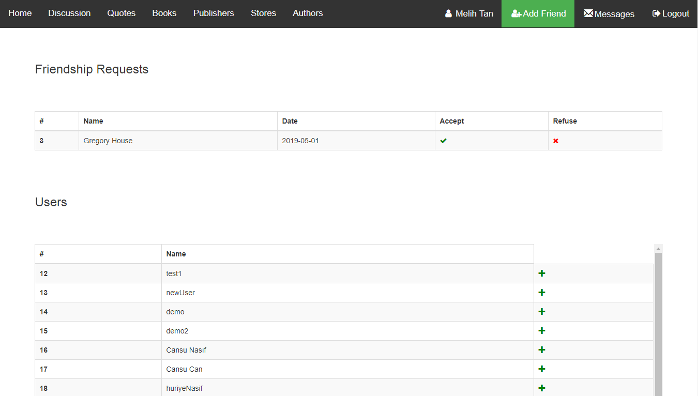

  <b>Figure 4</b> 

As you can see in the *Figure 4*, users can send friend request to other users and see friends requests has been sent to them. They can accept or decline these friend requests. While users can send friend requests only to other users, admins can send these requests to all users and admins.

### Home Page

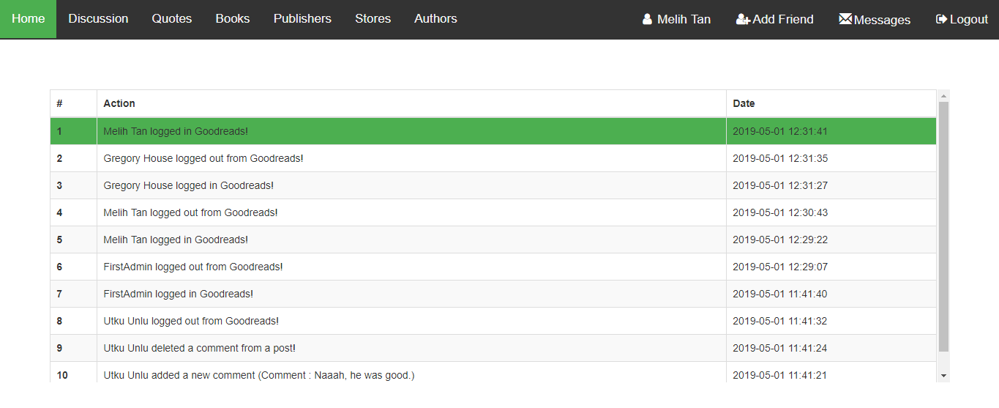

  <b>Figure 5</b> 

As you can see in the <i>Figure 5</i>, users can see users’ last 10 actions in the Home Page. 

### Discussion Page

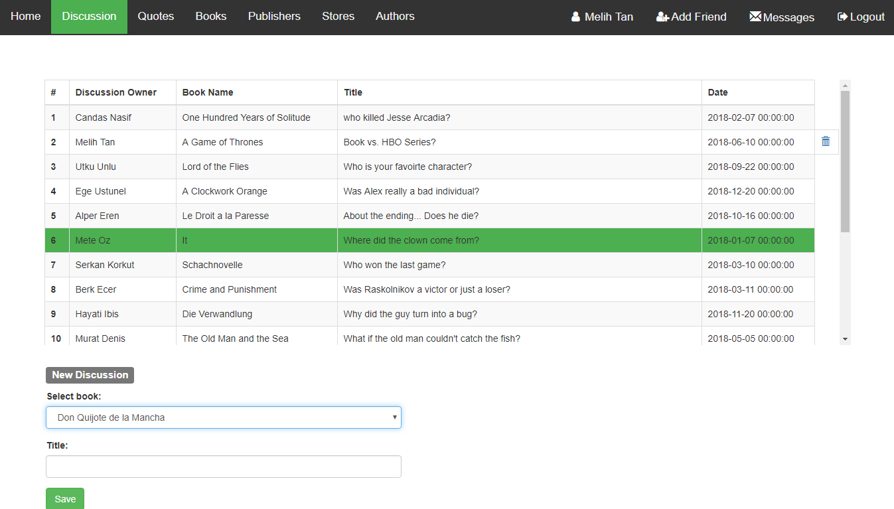

  <b>Figure 6</b> 

As you can see in the <i>Figure 6</i>, users can start discussion about the books they have read. They can also remove only the discussions they have started. On the other hand, admins can remove any discussion. Users can see the posts on these discussions when they click on them.

### Post Page

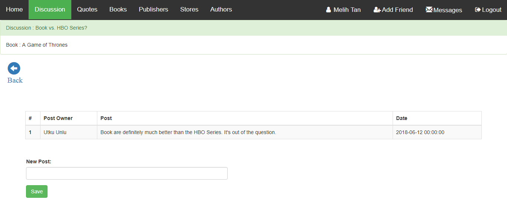

  <b>Figure 7</b> 

As you can see in the *Figure 7*, users can add posts under discussions and see other users’ posts. They are able to remove the posts of their own while admins can remove any posts in this Post Page. They can use the ‘Back’ button to return to Discussion Page. 

### Comment Page

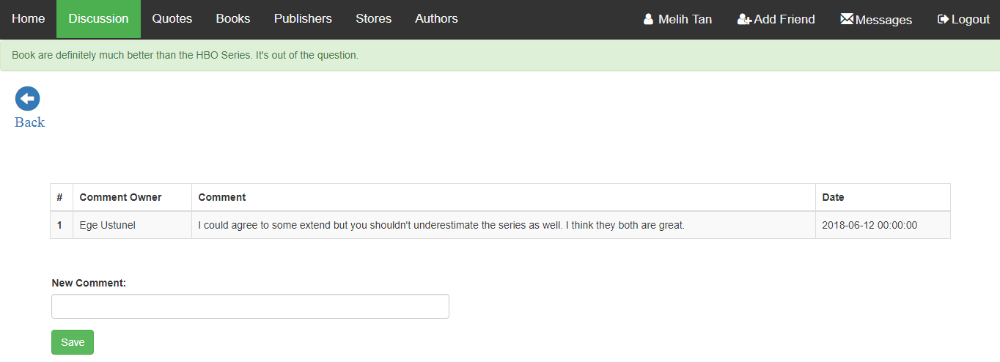

  <b>Figure 8</b> 

As you can see in the *Figure 8*, users can add comments to posts and also remove the comments of their own while admins can remove any comments in the Comment Page. They can use the ‘Back’ button to return to recent Post Page.  

### Quote Page

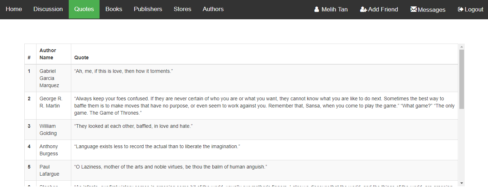

  <b>Figure 9</b> 

As you can see in the *Figure 9*, users can see quotes from authors and add quotes from authors yet just admins are able to delete these quotes. 

### Book Page

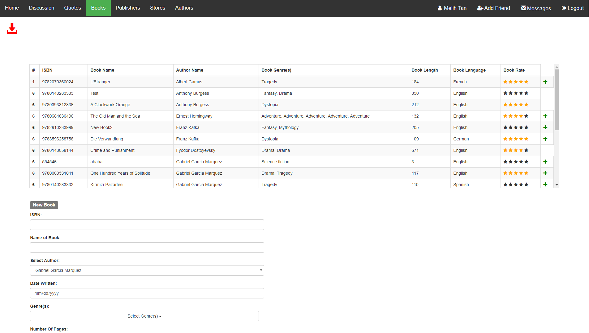

  <b>Figure 10</b> 

As you can see in the <i>Figure 10</i>, users can see the books in the database and their information. They can add books to their libraries in this Book Page, and they can also add new books to the database. They just see add buttons right next to the books they haven’t been read yet. And users can also print out this page as a pdf file.

### Publisher Page

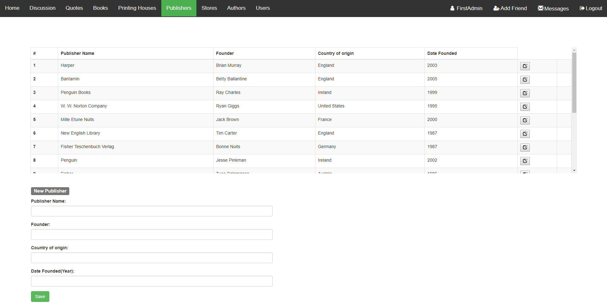

  <b>Figure 11</b> 

As you can see in the *Figure 11*, users can see the information of publisher in Publisher Page. But they are just able to see the information while admin can add, delete and update the information of publishers. 

### Store Page

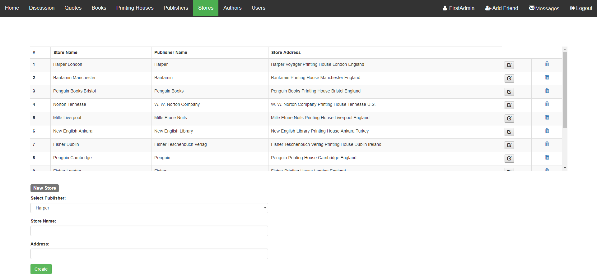

  <b>Figure 12</b> 

As you can see in the *Figure 12*, users are able to see the information of stores of publishers in the Store Page but they cannot add any store while admins can add, delete or update any store.

### Author Page
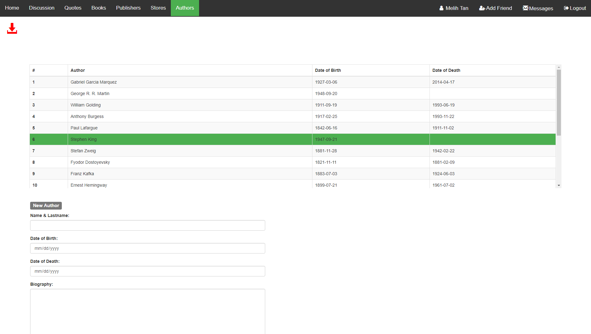

  <b>Figure 13</b> 

As you can see in the <i>Figure 13</i>, users are able to see the information of authors in the Author Page but they cannot delete the authors, even the ones they created. Only admins can delete or edit these author information. 

### Printing House Page

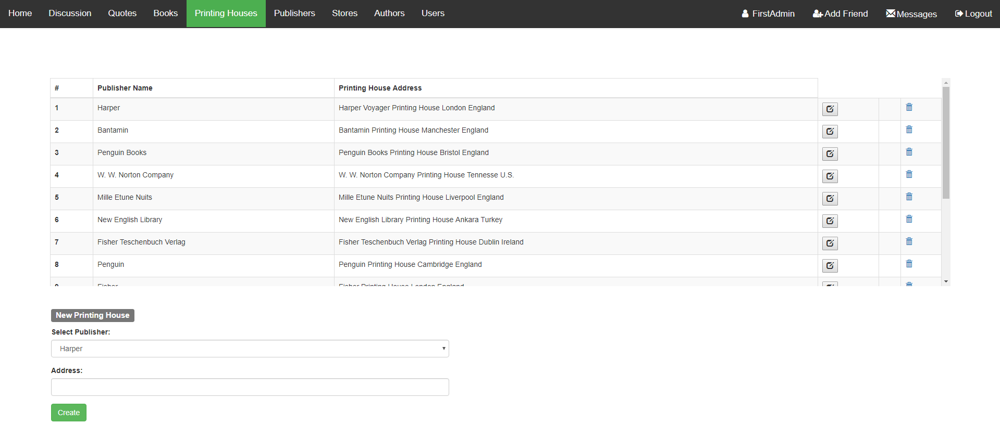

  <b>Figure 14</b> 

As you can see in the <i>Figure 14</i>, printing houses of publisher are listed. Only admins are able to see this page, they can add, delete, or update the information of publishing house. The 
purpose of the creation of this page is that they can share the information of printing houses with courier companies. 
